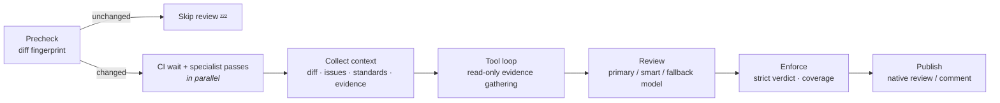

<div align="center">

# 🤖 pr-reviewer-action

**AI pull request reviews with any OpenAI- or Anthropic-compatible model — cloud or self-hosted.**

*Point it at your llama.cpp box or your Anthropic key. Either way, every PR gets a real review.*

[](https://github.com/misospace/pr-reviewer-action/actions/workflows/ci.yaml)
[](https://github.com/misospace/pr-reviewer-action/releases)
[](LICENSE)

**[Quick start](#-quick-start)** · **[Documentation](docs/README.md)** · **[Inputs](docs/inputs.md)** · **[Troubleshooting](docs/troubleshooting.md)** · **[Migrating from v2](docs/v3-migration.md)**

</div>

---

The action reviews each pull request with the model you point it at. It collects the diff, linked issues, CI results, repository standards and evidence; lets the model read the checkout through a bounded, read-only tool loop; and publishes structured findings with a verdict derived from them, as a native review or a sticky comment.

## ✨ Highlights

- 🏠 **Local-model-first**: ollama, llama.cpp, vLLM, LiteLLM, or any OpenAI/Anthropic-compatible endpoint, with an optional fallback model.
- 🔎 **Gathers its own evidence**: a native tool loop reads files, greps, follows git history and calls GitHub APIs or MCP servers before the verdict, with a budget that scales with the PR.
- 🧭 **Deterministic classification**: rule-based risk flags and required checks keep smaller models focused; specialist passes run only when the change warrants them.
- ⚖️ **Verdicts you can audit**: request changes only for open blocker/major findings, and a review that couldn't read everything says so and never approves.
- 💸 **Token-saving**: an unchanged diff skips the model entirely and carries the prior verdict forward.
- 🛡️ **Safe by default**: standards and prompts read from the base branch, read-only tools, secret redaction, approvals off, fork PRs isolated.

## 🚀 Quick start

```yaml
name: AI PR Review

on:
  pull_request:
    types: [opened, reopened, synchronize, ready_for_review]

permissions:
  contents: read
  pull-requests: write
  checks: read

jobs:
  review:
    if: ${{ !github.event.pull_request.draft }}
    runs-on: ubuntu-latest
    steps:
      - uses: actions/checkout@v5
        with:
          fetch-depth: 0
          ref: ${{ github.event.pull_request.head.sha }}

      - uses: misospace/pr-reviewer-action@v3
        with:
          ai-base-url: ${{ vars.AI_BASE_URL }}
          ai-api-key: ${{ secrets.AI_API_KEY }}
          ai-model: ${{ vars.AI_MODEL }}
```

That is the whole setup: an OpenAI-compatible endpoint (set `ai-api-format: anthropic` for an Anthropic-compatible one), its key, and a model. The defaults are the recommended configuration: the native tool loop gathers evidence from the checkout, specialist leads run when the change warrants them, CI results are folded in as evidence, and findings post as a non-blocking review anchored to the diff. `github-token` defaults to the job token. The `if:` guard on the job is a cheap early exit, not the authority — the action's precheck skips draft PRs deterministically, so a workflow that forgot it still never reviews a draft.

### Specialist model overrides

Deep-review specialists inherit the primary model by default. These workflow inputs opt into a shared specialist profile and optional model-only role overrides; the profile's endpoint and credentials are shared by all three roles.

| Input | Purpose |
|---|---|
| `ai-specialist-model` | Enable a specialist model profile; blank keeps the current primary-profile behavior. |
| `ai-specialist-base-url` | Optional profile endpoint; blank inherits the primary endpoint. Requires `ai-specialist-model`. |
| `ai-specialist-api-format` | Optional profile format (`openai` or `anthropic`); blank inherits the primary format. Requires `ai-specialist-model`. |
| `ai-specialist-api-key` | Optional profile key; blank inherits the primary key. Requires `ai-specialist-model`. |
| `ai-specialist-correctness-model` | Model-only override for the correctness role. |
| `ai-specialist-security-model` | Model-only override for the security role. |
| `ai-specialist-tests-model` | Model-only override for the tests role. |

Role overrides share the profile transport and are ignored with a warning for `DEEP_REVIEW_EXECUTION=combined_scout`, which makes a single shared model call. See [Models and routing](docs/models-and-routing.md#specialist-profile-overrides) for precedence and examples.

**Requirements:** it is a JavaScript action (`runs.using: node24`), so GitHub-hosted runners need nothing installed; the runner provides Node. The repository under review must be checked out (`fetch-depth: 0` gives the history context). `checks: read` lets the review wait for CI; without it the CI evidence is skipped. On Forgejo, use runner 9 or newer with a job image that has Node 22+ and `git`.

## ⚙️ How it works



## 🖥️ Platform support

The action works on **GitHub** and **Forgejo** (1.4.x), with **Tangled** resolvable as a platform. Set `platform: auto` (default) to detect automatically from `TANGLED_REPO_DID` (the Tangled repository owner DID, checked first), `GITHUB_SERVER_URL`, and `FORGEJO_API_URL`, or set explicitly to `forgejo` / `github` / `tangled` (explicit `tangled` requires `TANGLED_REPO_DID`). Tangled is resolution-only for now: its backend operations are not implemented yet and fail loudly until follow-up work lands.

| Feature | GitHub | Forgejo |
|---|---|---|
| PR diff, files, metadata | ✅ Full | ✅ Full (REST backend) |
| Managed sticky comment | ✅ Full | ✅ Full |
| Native review comments (`review_comment`) | ✅ Full | ⚠️ Degraded — REST-based; no inline line anchors |
| Native review verdicts (`review_verdict`) | ✅ Full | ⚠️ Degraded — approve/request_changes via REST |
| Cleanup: dismiss stale reviews | ✅ Full | ✅ Full (REST) |
| Cleanup: minimizeComment (hide outdated) | ✅ Full | ❌ Skipped (no GraphQL) |
| CI status check polling | ✅ Full | ✅ Commit-status polling (Forgejo REST; own single-job status auto-discovered by run-jobs API) |
| Evidence providers | ✅ Full | ✅ Full |
| Tool harness | ✅ Full | ✅ Full |
| Reviewer-requested smart escalation | ✅ Full | ✅ Full |

> **Note:** On Forgejo, features requiring GitHub's GraphQL API (review minimization) are skipped with a clear log line. CI auto-discovery requires Forgejo v16.0+ (the first release with the run-jobs API) and excludes a pending status only when that API proves this is a single-job run and that job's `html_url` path exactly matches the status `target_url` path on the runner's origin. `FORGEJO_RUN_NUMBER`/`GITHUB_RUN_NUMBER` identify candidate status URLs; `FORGEJO_RUN_ID` (or `GITHUB_RUN_ID` fallback) is used only to query the jobs API. Multi-job, mismatched, and unavailable cases leave statuses visible; older Forgejo instances warn immediately and fall back to bounded waiting, so set `CI_STATUS_CONTEXT` to avoid self-deadlock; a whitespace-only value is treated as unset and enables auto-discovery. Multi-job reviewer workflows also need `CI_STATUS_CONTEXT`. The core review pipeline and all REST-based features work fully.

## 📚 Documentation

| Topic | Page |
|---|---|
| Every input and output, with defaults | [Inputs and outputs](docs/inputs.md) |
| What the reviewer sees and how to steer it (standards, prompts, evidence, CI) | [Context and evidence](docs/context-and-evidence.md) |
| The native tool loop, budgets and partial coverage | [Tool loop](docs/tool-loop.md) |
| Specialist passes and `deep-review: auto` | [Deep review](docs/deep-review.md) |
| Verdict policies, publish modes, re-reviews | [Verdicts and publishing](docs/verdicts-and-publishing.md) |
| Endpoints, fallback and fast/smart routing | [Models and routing](docs/models-and-routing.md) |
| Review marker fields and the step summary | [Telemetry](docs/telemetry.md) |
| Default-off experimental features | [Opt-in features](docs/opt-in-features.md) |
| Local model issues and common misconfigurations | [Troubleshooting](docs/troubleshooting.md) |
| Repository-owned config file | [Repository config](docs/repository-config.md) |
| Reviewing pull requests from forks | [Fork reviews](docs/fork-review.md) |
| Upgrading from v2 | [v2 → v3 migration](docs/v3-migration.md) |

Copyable workflows: [`examples/workflow-self-hosted.yml`](examples/workflow-self-hosted.yml) and [`examples/workflow-cloud.yml`](examples/workflow-cloud.yml).

## 📌 Version pinning and releases

The action is versioned with Git tags. `@v3` is a floating major tag; for reproducible runs, pin a release tag or its commit SHA (Renovate keeps either current):

```yaml
- uses: misospace/pr-reviewer-action@v3.1.0
# or
- uses: misospace/pr-reviewer-action@aa12ad9909b1ee8a5a7fe00dceeb1a8c97ab27dd # v3.1.0
```

Release tags point at a build commit that contains `dist/`; `main` does not carry the bundle. Releases are cut by merging the standing `release: X.Y.Z` pull request that release-please maintains.

### 🗓️ Versioning policy

- **Patch** (`Z`): bug fixes, docs, performance work and internal refactors.
- **Minor** (`Y`): new inputs, outputs, tools or modes, and deliberate changes to the reviewer's operating point (such as the v3.1.0 tool budget). Release notes call out anything that changes review behavior.
- **Major** (`X`): anything that can require editing your workflow, such as removing or renaming inputs/outputs or dropping platform support.
- **Deprecations** keep working, with a log warning, for the rest of the current major.
- **`source-vX.Y.Z` tags** mark each release's source commit on `main` for release tooling. They have no `dist/`, so never pin to them.
- **Pre-releases** (`vX.Y.Z-rc.N`) never move the floating major tag.

Subscribe to [GitHub Releases](https://github.com/misospace/pr-reviewer-action/releases) to follow changes.

### 🚚 v3 breaking changes

If you used `review_scope: auto|incremental|full` in v2, remove the input in v3. There is no replacement: every changed review uses the full current PR. Keep `skip-if-diff-unchanged` for the zero-token unchanged-review skip; it retains the prior overall verdict. The `ai-review` label, a `/ai-review` PR comment, or `force-review: "true"` still forces a fresh full review. Comment re-review is for triage-or-higher commenters only (fork PRs get a reply pointing at the fork review workflow) and an empty `rereview-command` disables it — see [Verdicts and publishing](docs/verdicts-and-publishing.md#comment-command).

Stop reading the removed incremental outputs (`effective_review_scope`, `previous_head_sha`, `previous_base_sha`, `baseline_clean`) and remove `escalate_on_dirty_baseline` if configured. Previous findings and evidence are not carried into a new review. No replacement scope or dirty-baseline setting is needed.

## 🧪 Development

```bash
npm ci && npm run typecheck && npm test   # v3 suite, end-to-end against mock platform and model servers
pytest tests/ -q                           # retained Python gates and tooling
```

Contributor and agent docs (code map, architecture, eval runbooks) start at [`AGENTS.md`](AGENTS.md); evaluation is in [`docs/evals.md`](docs/evals.md).

## 🔐 Security

See [SECURITY.md](SECURITY.md) for the threat model, controls, and operational guidance.

### Fork PR reviews

Pull requests from forks are reviewed by a separate, privilege-separated
workflow (`fork-ai-review.yaml`): default-deny behind the maintainer-only
`ai-review-fork` label, local models only, no fork code ever checked out or
executed in the privileged run, and bounded compute. The same-repository
dogfood reviewer skips fork PRs cleanly. See
[docs/fork-review.md](docs/fork-review.md) for the threat model, the
authorization flow, and the required `FORK_*` configuration.

## 📄 License

[MIT](LICENSE)

---

<div align="center">

Built for homelabs and production alike — if this action reviews your PRs well, consider **[starring the repo ⭐](https://github.com/misospace/pr-reviewer-action)**

<sub>[⬆ Back to top](#-pr-reviewer-action)</sub>

</div>
